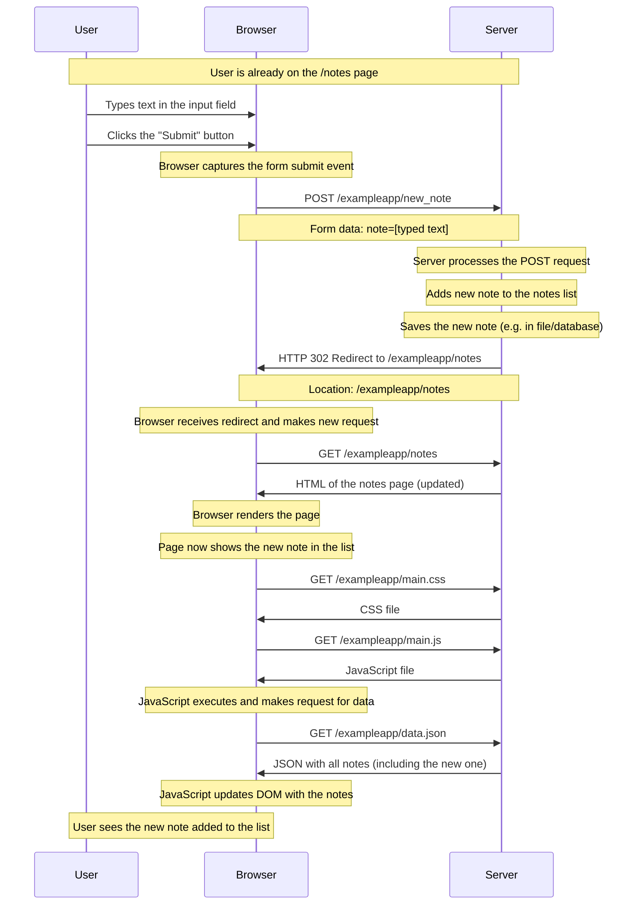

# Diagram: Creating a New Note

This diagram represents the complete flow when a user creates a new note in the application <https://studies.cs.helsinki.fi/exampleapp/notes>.

```mermaid
sequenceDiagram
    participant U as User
    participant B as Browser
    participant S as Server

    Note over U,S: User is already on the /notes page

    U->>B: Types text in the input field
    U->>B: Clicks the "Submit" button

    Note over B: Browser captures the form submit event

    B->>S: POST /exampleapp/new_note
    Note over B,S: Form data: note=[typed text]

    Note over S: Server processes the POST request
    Note over S: Adds new note to the notes list
    Note over S: Saves the new note (e.g. in file/database)

    S->>B: HTTP 302 Redirect to /exampleapp/notes
    Note over S,B: Location: /exampleapp/notes

    Note over B: Browser receives redirect and makes new request

    B->>S: GET /exampleapp/notes
    S->>B: HTML of the notes page (updated)

    Note over B: Browser renders the page
    Note over B: Page now shows the new note in the list

    B->>S: GET /exampleapp/main.css
    S->>B: CSS file

    B->>S: GET /exampleapp/main.js
    S->>B: JavaScript file

    Note over B: JavaScript executes and makes request for data

    B->>S: GET /exampleapp/data.json
    S->>B: JSON with all notes (including the new one)

    Note over B: JavaScript updates DOM with the notes
    Note over U,B: User sees the new note added to the list
```
