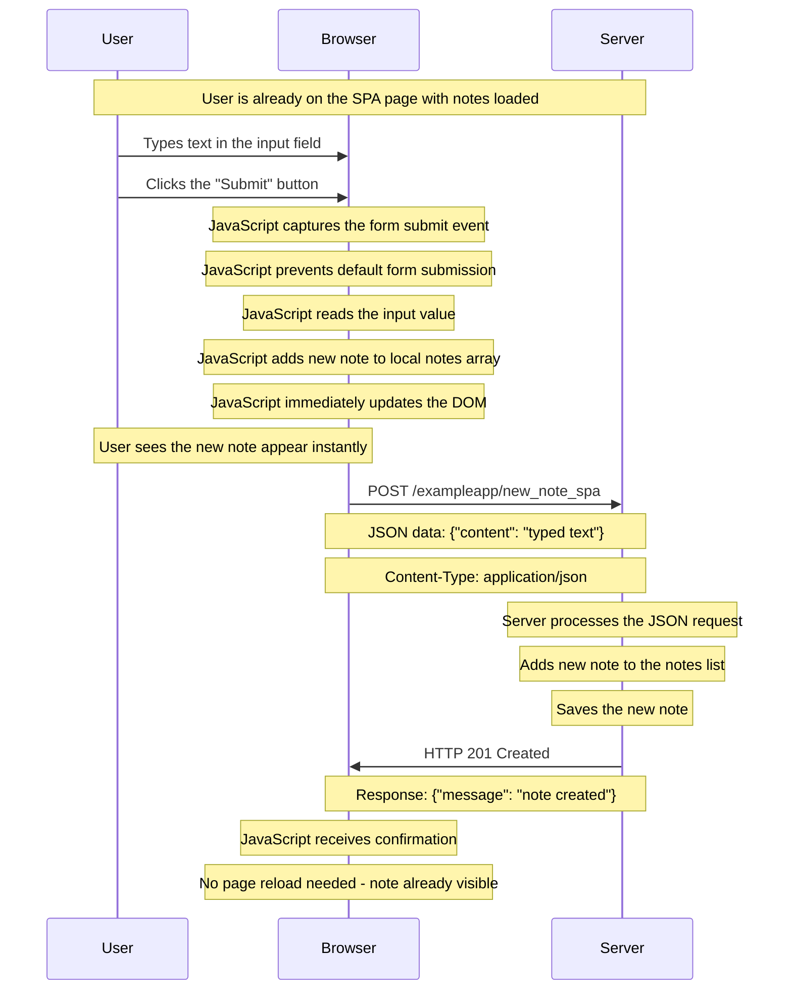

# 0.6: New Note in SPA Diagram

This diagram depicts the situation where the user creates a new note using the single-page application version.

```mermaid
sequenceDiagram
    participant U as User
    participant B as Browser
    participant S as Server

    Note over U,S: User is already on the SPA page with notes loaded

    U->>B: Types text in the input field
    U->>B: Clicks the "Submit" button

    Note over B: JavaScript captures the form submit event
    Note over B: JavaScript prevents default form submission
    Note over B: JavaScript reads the input value

    Note over B: JavaScript adds new note to local notes array
    Note over B: JavaScript immediately updates the DOM
    Note over U,B: User sees the new note appear instantly

    B->>S: POST /exampleapp/new_note_spa
    Note over B,S: JSON data: {"content": "typed text"}
    Note over B,S: Content-Type: application/json

    Note over S: Server processes the JSON request
    Note over S: Adds new note to the notes list
    Note over S: Saves the new note

    S->>B: HTTP 201 Created
    Note over S,B: Response: {"message": "note created"}

    Note over B: JavaScript receives confirmation
    Note over B: No page reload needed - note already visible
```
